# Шаг 5: Пример и схема ответа

| [*Шаг 1. Описание ресурса*](step1-resourse-description.md) |-->| [*Шаг 2. Конечные точки и методы*](step2-endpoints-and-methods.md) |-->| [*Шаг 3. Параметры*](step3-parameters.md) |-->| [*Шаг 4. Пример запроса*](step4-request-example.md)|-->| [**Шаг 5. Пример и схема ответа**](step5-response-example-and-schema.md) |

Пример ответа показывает ответ на пример запроса. Схема ответа определяет все возможные элементы в ответе. Пример ответа не является исчерпывающим для всех конфигураций параметров или операций, но он должен соответствовать параметрам, переданным в примере запроса. Ответ позволяет разработчикам узнать, содержит ли ресурс информацию, которую они хотят, формат и структура информации и т.д.

Описание ответа иногда еще называют схемой ответа. Схема ответа документирует ответ более полным, общим способом, перечисляя каждое свойство, которое может быть возвращено, что содержит каждое свойство, формат данных значений, структуру и другие подробности.

[Примеры и схемы ответов](#examples)

[Нужно ли определять ответ?](#define)

[Использование реалистичных значений в примере ответа](#realistic)

[Форматируем JSON и используем подсветку синтаксиса кода](#highlight)

[Стратегии документирования вложенных объектов](#strategies)

[Дизайн в три колонки](#threeColomn)

[Встраивание динамических ответов](#embedding)

[Что насчет статуса кода?](#codeSatuse)

[Пример и схема ответа конечной точки SurfReport](#surfReportExample)

[Следующие шаги](#nextSteps)

<a name="examples"></a>
## Примеры и схемы ответов

Ниже приведен пример ответа от SendGrid API. Их документация обеспечивает отображение **Примера** на одной вкладке:

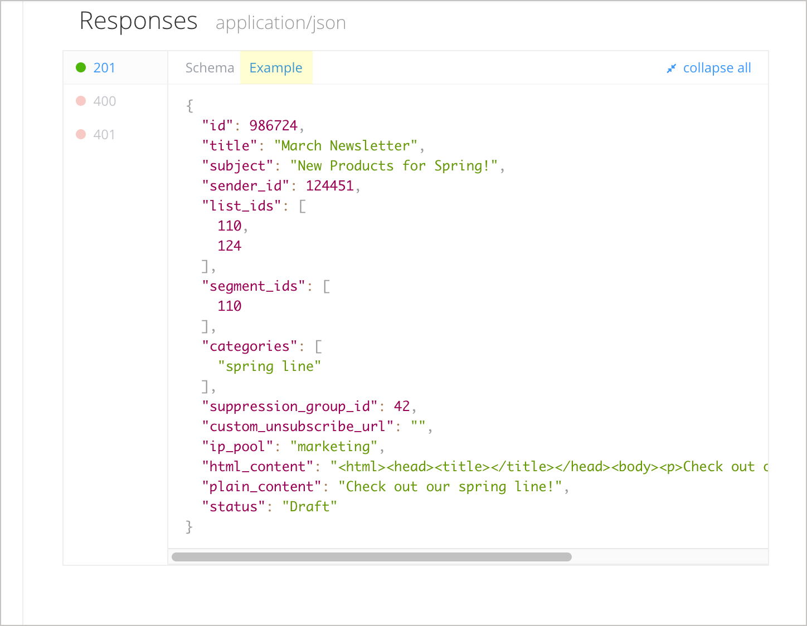

А схема ответа на другой вкладке:

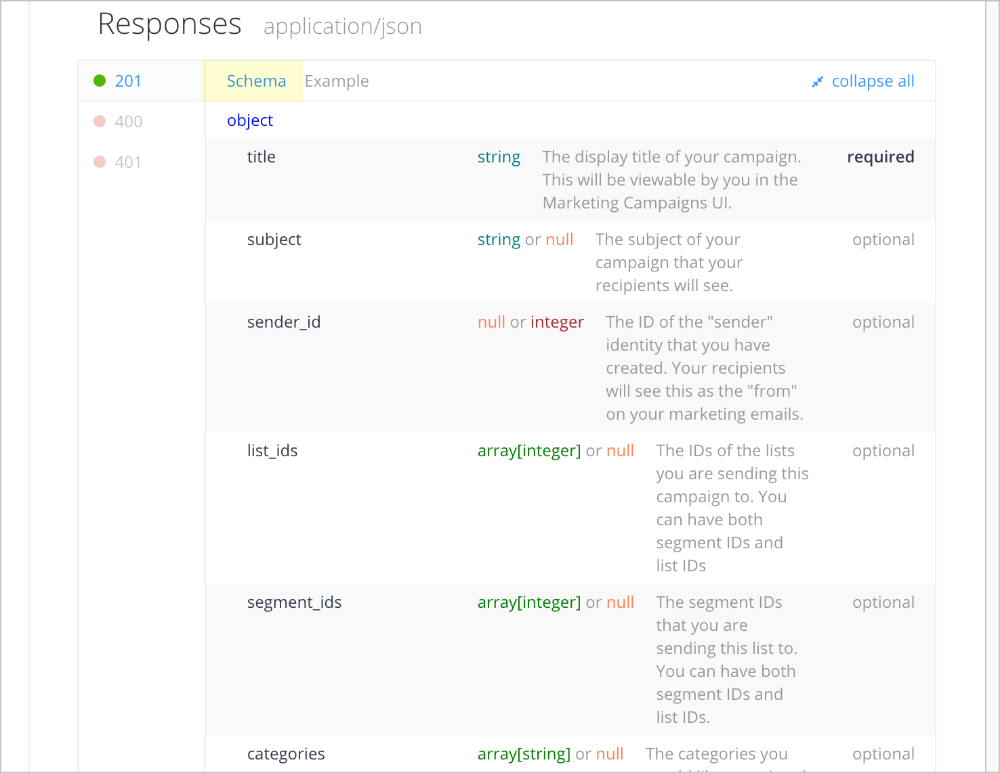

Определение ответа называется схемой или моделью (термины используются как синонимы) и равняется на [язык и описания схемы JSON](http://json-schema.org/). Что особенно хорошо в примере SendGrid, так это использование тегов раскрытия / свертывания для отражения той же структуры, что и в примере, с объектами на разных уровнях.

Swagger UI также предоставляет и пример значения и схему/модель. Например, в [примере документа API Sunrise и Sunset Times](https://idratherbewriting.com/learnapidoc/assets/files/swagger-sunrise-sunset/index.html#/default/getSunriseSunset), который используется в практике SwaggerUI (которое будет приведено позже в курсе), можно увидеть различие между примером ответа и схемой ответа. Вот **Пример значения**:

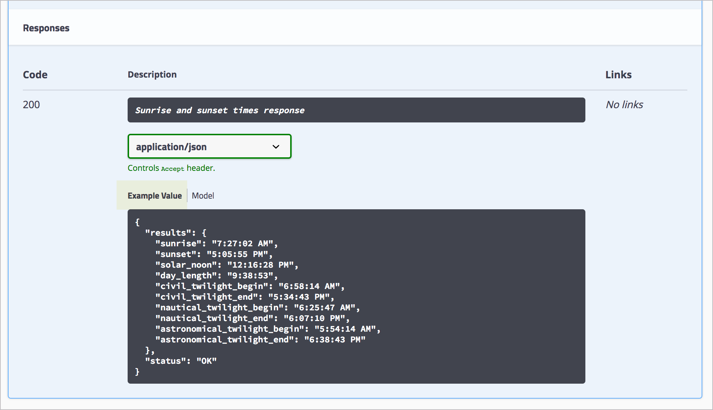

Пример ответа должен соответствовать примеру запроса. Так же, как пример запроса может включать только подмножество всех возможных параметров, пример ответа также может быть подмножеством всей возможной возвращаемой информации.

Схема ответа содержит все возможные свойства, возвращаемые в ответе. Вот почему нужен и пример ответа, и схема ответа. Вот схема ответа для API Sunrise и Sunset Times:

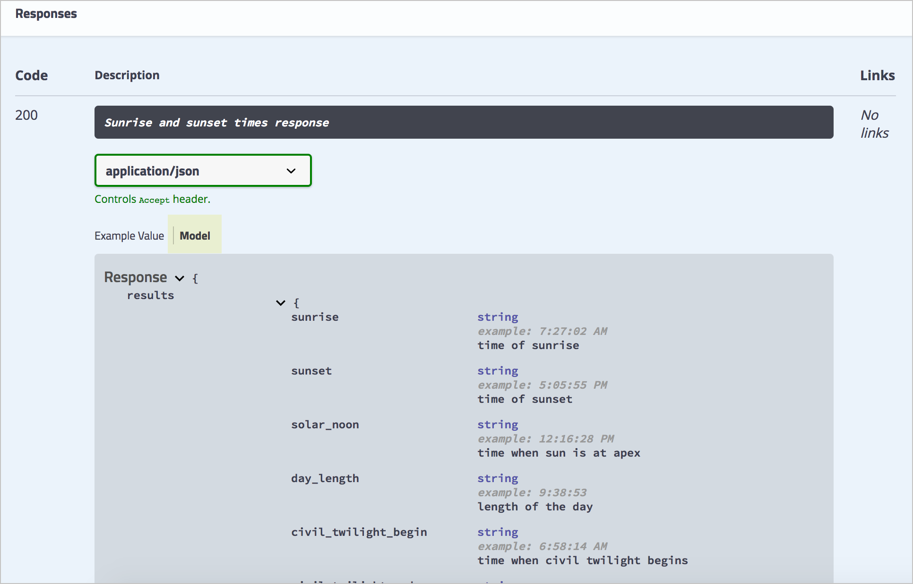

Схема или модель обеспечивает следующее:

- Описание каждого свойства;
- Определение типа данных для каждого свойства;
- Является ли каждое свойство обязательным или необязательным.

Если информацию заголовка важно включить в пример ответа (поскольку она предоставляет уникальную информацию, отличную от стандартных [кодов состояния](../conceptual-topics/status-error-codes.md)), то ее также надо включить .

<a name="define"></a>
## Нужно ли определять ответ?

В некоторой документации API схема ответа может отсутствовать, поскольку ответы могут показаться самоочевидными или интуитивно понятными. В API Twitter ответы не поясняются (вот пример [здесь](https://developer.twitter.com/en/docs/accounts-and-users/manage-account-settings/api-reference/get-account-settings)).

Большая часть документации была бы лучше с подробно описанным ответом, особенно если свойства являются сокращенными или загадочными. Разработчики иногда сокращают ответы, чтобы повысить производительность за счет уменьшения объема отправляемого текста. В одной конечной точке, ответ содержал около 20 различных аббревиатур из двух букв. Чтобы выяснить, что означает каждая аббревиатура, было потрачено несколько дней и обнаружено, что многие разработчики, работавшие над этим API, даже не знали, что означают многие ответы.

<a name="realistic"></a>
## Использование реалистичных значений в примере ответа

В примере ответа значения должны быть реалистичными, а не реальными. Если разработчики дают вам пример ответа, убедитесь, что значения являются разумными и не отталкивающе фальшивыми (например, пользователи, состоящие из имен персонажей комиксов).

Кроме того, образец ответа не должен содержать реальных данных клиента. Если вы получаете пример ответа от разработчика и данные выглядят реальными, убедитесь, что они получены не из клонированной только что производственной базы данных, как это обычно делается. Разработчики могут не осознавать, что данные должны быть вымышленными, но репрезентативными, и очистка производственной базы данных может быть для них самым простым подходом.

<a name="highlight"></a>
## Форматируем JSON и используем подсветку синтаксиса кода

Используйте правильный формат JSON для ответа. Такие инструменты, как [JSON Formatter and Validator](https://jsonformatter.curiousconcept.com/), помогут скорректировать синтаксис.


Если есть возможность добавить подсветку синтаксиса, обязательно нужно делать это. При использовании статического генератора сайтов, например [Jekyll]() или синтаксис Markdown, с [GitHub](), можно использовать встроенную подсветку синтаксиса [Rouge](https://github.com/jneen/rouge). Другие статические генераторы сайтов могут использовать [Pygments](http://pygments.org/) или аналогичные расширения.

Rouge и Pygments полагаются на «лексеры», чтобы указать, как код должен быть выделен. Например, некоторыми распространенными лексерами являются `java`, `json`, `html`, `xml`, `cpp`, `dotnet` и `javascript`.

<a name="strategies"></a>
## Стратегии документирования вложенных объектов

Часто бывает, ответ содержит вложенные объекты (объекты внутри объектов) или повторяющиеся элементы. Форматирование документации для схемы ответа является одним из наиболее сложных аспектов справочной документации API.

Очень популярно использование таблиц. В [курсе Петера Грюнбаума по технической документацииAPI для Udemy](https://www.udemy.com/api-documentation-1-json-and-xml/) Грюнбаум представляет вложенные объекты, используя таблицы с различными столбцами:


Грюнбаум использует таблицы главным образом для того, чтобы уменьшить акцент на инструментах и ​​уделить больше внимания контенту.

Dropbox API представляет вложение косой чертой. Например, `name_details/`, `team/` и `quota_info` указывают несколько уровней объекта.

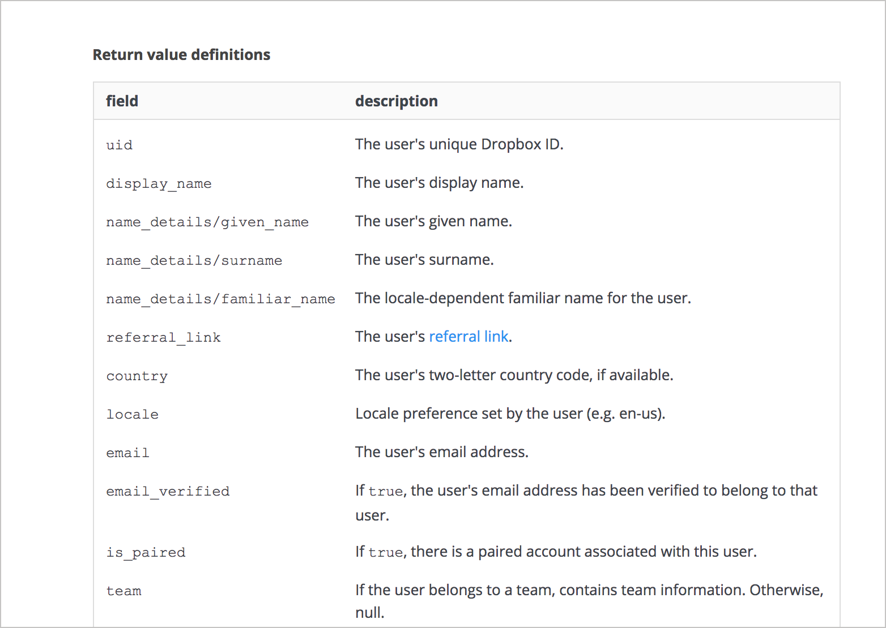


Другие API будут вкладывать определения ответов для имитации структуры JSON. Вот пример из bit.ly API:

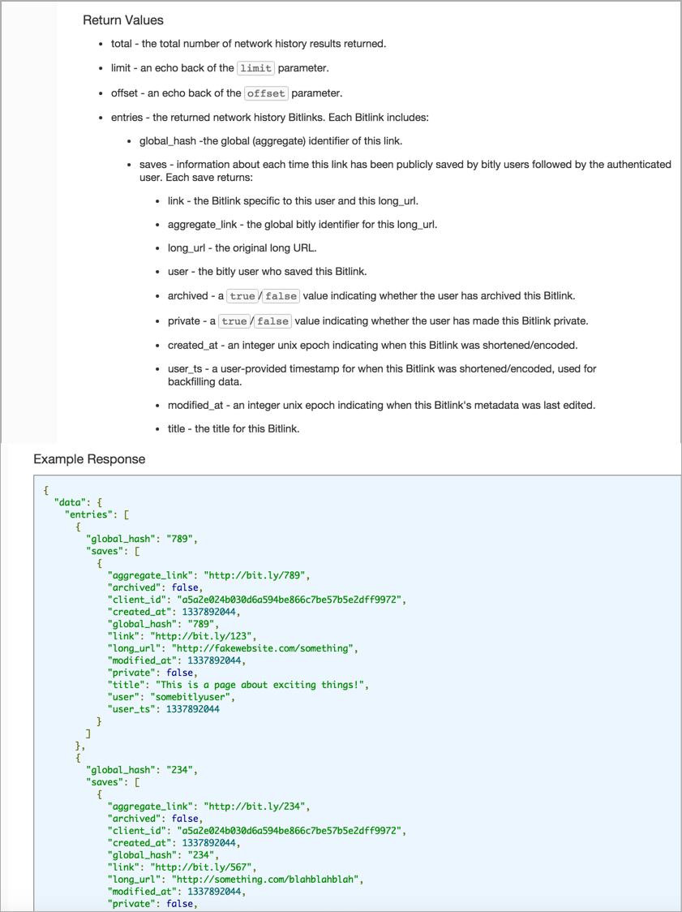

Многоуровневые списки обычно являются бельмом на глазу, но здесь они служат цели, которая хорошо работает, не требуя сложного моделирования.


Подход eBay еще уникальнее. В их случае `MinimumAdvertisedPrice` вложен в `DiscountPriceInfo`, который вложен в `Item`, который вложен в `ItemArray`. (Обратите внимание, что этот ответ находится в формате XML вместо JSON.):

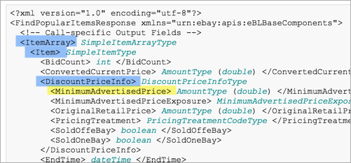

Вот документация ответа:

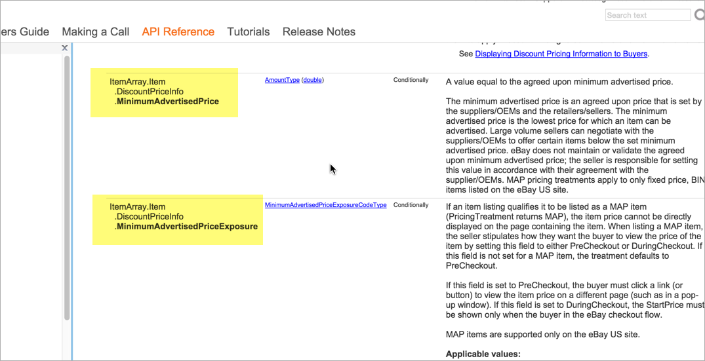

Также интересно, сколько деталей eBay включает для каждого элемента. В то время как авторы Twitter, опускают описания, авторы eBay пишут небольшие романы, описывающие каждый элемент в ответе.

<a name="threeColomn"></a>
## Дизайн в три колонки

Некоторые API-интерфейсы помещают ответ в правый столбец, чтобы вы могли видеть его, одновременно просматривая описание и параметры ресурса. API Stripe сделал этот дизайн в три колонки популярным:

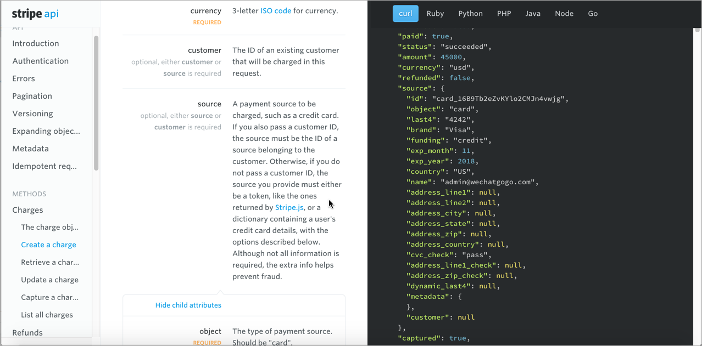

В дизайне Stripe образец ответа сопоставляется в правой части окна со схемой ответа в главном окне. Идея в том, что вы можете видеть и то и то одновременно. Описание не всегда совпадает с ответом, что может привести к путанице. Тем не менее, разделение примера ответа от схемы ответа в отдельных столбцах помогает различать их.


Многие API смоделировали свой дизайн после Stripe. Например, [Slate](https://github.com/lord/slate), [Spectacle](https://github.com/sourcey/spectacle) или [Readme.io](http://readme.io/). Следует ли использовать Дизайн в три колонки с документацией по API? Может быть. Но если пример ответа и описание не совпадают, внимание пользователя несколько расфокусируется, и пользователь должен прибегнуть к дополнительной прокрутке вверх-вниз. Кроме того, если в дизайне используется три столбца, средний столбец может иметь некоторые ограничения, которые не оставят много места для скриншотов и примеров кода.


MYOB Developer Center использует интересный подход к документированию JSON в своих API. Они перечисляют структуру JSON в виде таблицы, с разными уровнями отступов. Можно навести курсор мыши на поле с для появления  всплывающей подсказки с описанием или щелкнуть по полю, чтобы раскрыть описание ниже. Использование всплывающих подсказок позволяет идеально выровнять строки, содержащие пример и описание.

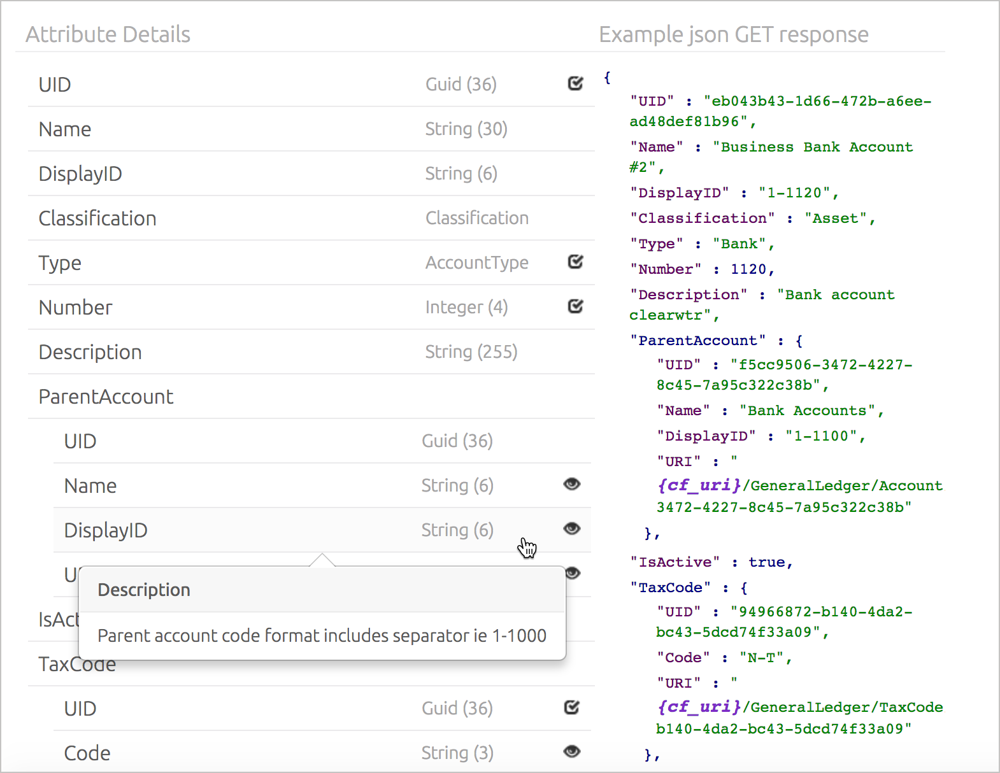

Такой подход облегчает поиск, а подход с всплывающими подсказками и раскрывающимся описанием позволяет сжать таблицу, чтобы можно было переходить к интересующим частям. Однако этот подход требует больше ручной работы с точки зрения документации. Тем не менее, для длинных объектов JSON, это может стоить того.

<a name="embedding"></a>
## Встраивание динамических ответов

Иногда ответы генерируются динамически на основе вызовов API в тестовой системе. Например, посмотрите на [API Rhapsody](https://developer.rhapsody.com/api) и щелкните конечную точку - ответ генерируется динамически.


Другой API с динамическими ответами - это [API OpenWeatherMap](https://openweathermap.org/current) (с которым мы практиковались ранее). Если щелкнуть ссылку в разделе «Примеры вызовов API», например [http://samples.openweathermap.org/data/2.5/weather?q=London](http://samples.openweathermap.org/data/2.5/weather?q=London), вы увидите ответ, возвращенный в браузере.

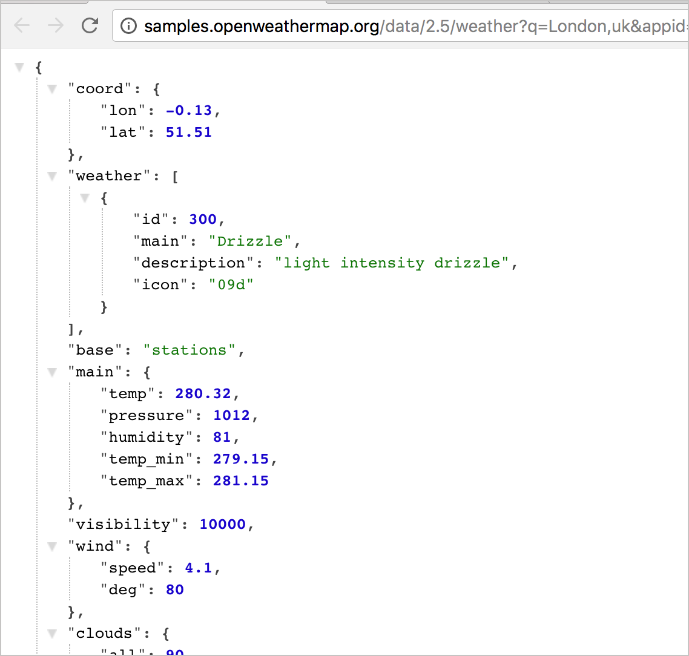

На самом деле, ответ OpenWeatherMap не генерируется динамически, но он так выглядит

API Citygrid, который мы рассмотрели в разделе [Пример запроса](step4-request-example.md), также динамически генерирует ответы.

Такой динамический подход хорошо подходит для запросов GET, которые возвращают публичную информацию. Однако, вероятно, он не будет масштабироваться для других методов (таких как POST или DELETE) или для запроса авторизации.

<a name="codeSatuse"></a>
## Что насчет статуса кода?

В разделе ответов иногда кратко перечисляются возможные статусы и коды ошибок, возвращаемые вместе с ответами. Однако, поскольку эти коды обычно используются всеми конечными точками в API, статусы и коды ошибок часто документируются в отдельном разделе, отдельно от документации конкретной конечной точки. Все это есть в разделе [Статусы и коды ошибок](../conceptual-topics/status-error-codes.md).

<a name="surfReportExample"></a>
## Пример и схема ответа конечной точки SurfReport

Давайте создадим раздел для нашей конечной точки `surfreport/{beachId}` , в котором покажем пример и схема ответа. Вот пример к  разделу:

### Пример ответа

Ниже пример ответа конечной точки `surfreport/{beachId}`

```yaml
{
    "surfreport": [
        {
            "beach": "Santa Cruz",
            "monday": {
                "1pm": {
                    "tide": 5,
                    "wind": 15,
                    "watertemp": 80,
                    "surfheight": 5,
                    "recommendation": "Go surfing!"
                },
                "2pm": {
                    "tide": -1,
                    "wind": 1,
                    "watertemp": 50,
                    "surfheight": 3,
                    "recommendation": "Surfing conditions are okay, not great."
                },
                "3pm": {
                    "tide": -1,
                    "wind": 10,
                    "watertemp": 65,
                    "surfheight": 1,
                    "recommendation": "Not a good day for surfing."
                }
                ...
            }
        }
    ]
}
```

В таблице ниже описание для каждого пункта

| Пункт ответа | Описание | Тип данных |
|:--|:--|:--|
| **beach** | Пляж, выбранный  на основе идентификатора пляжа в запросе. Название пляжа - это официальное название, описанное в базе геоданных Службы национальных парков.  | string |
| **{day}** | Выбранный день недели. В ответ возвращается максимум 3 дня. | Object |
| **{time}** | Выбранное время для погодный условий. Этот элемент включается только в том случае, если в запрос включен параметр времени. | string |
| {day}/{time}/**tide** | Уровень прилива на пляже в определенный день и время. Прилив - это расстояние внутри страны, до которого поднимается вода, и может быть положительным или отрицательным числом. При отливе, число отрицательное. При приливе, число положительное. Точка 0 отражает линию, при отсутствии прилива/отлива, и находится в переходе между двумя состояниями.  | Integer |
| {day}/{time}/**wind** | Скорость ветра на пляже измеряется в узлах (морских миль в час). Ветер влияет на высоту прибоя и общие условия волнения. Скорость ветра более 15 узлов делает условия серфинга нежелательными, потому что ветер создает белые шапки и неспокойную воду. | Integer |
| {day}/{time}/**watertemp** | Температура воды, возвращаемая в градусах Фаренгейта или Цельсия, в зависимости от указанных единиц измерения. Для температуры воды ниже 70 F может потребоваться гидрокостюм. При температуре ниже 60, вам понадобится как минимум 3-миллиметровый гидрокостюм и желательно пинетки, чтобы согреться. | Integer |
| {day}/{time}/**surfheight** | Высота волн возвращается в футах или сантиметрах в, зависимости от указанных единиц измерения. Высота прибоя 3 фута - минимальный размер, необходимый для серфинга. Если высота прибоя превышает 10 футов, заниматься серфингом небезопасно.  | Integer |
| {day}/{time}/**recommendation** | Общая рекомендация, основанная на сочетании различных факторов (ветер, температура воды, высота полета). Возможны три варианта ответа: (1) «Займитесь серфингом!», (2) «Условия серфинга в порядке, но не круто», и (3) «Не очень хороший день для серфинга». Каждый из трех факторов оценивается максимум в 33,33 балла, в зависимости от идеала для каждого элемента. Три элемента объединены, чтобы сформировать процент. От 0% до 59% дает ответ 3, от 60% до 80% дает ответ 2, а от 81% до 100% дает ответ 1. | String |

<a name="nextSteps"></a>
## Следующие шаги

Мы прошлись по каждому из разделов, теперь взглянем на них вместе в разделе [Собираем все вместе](putt-all-together.md).

[🔙](step4-request-example.md)

[Go next ➡](putt-all-together.md)
