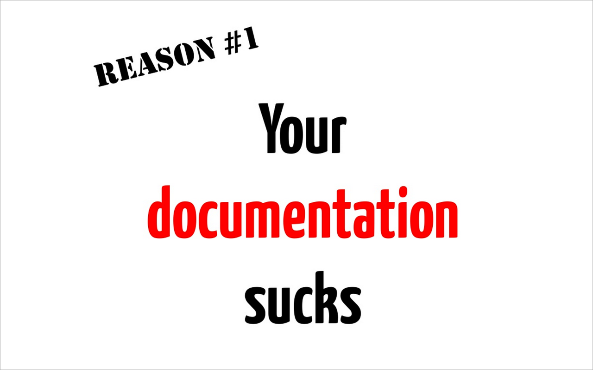
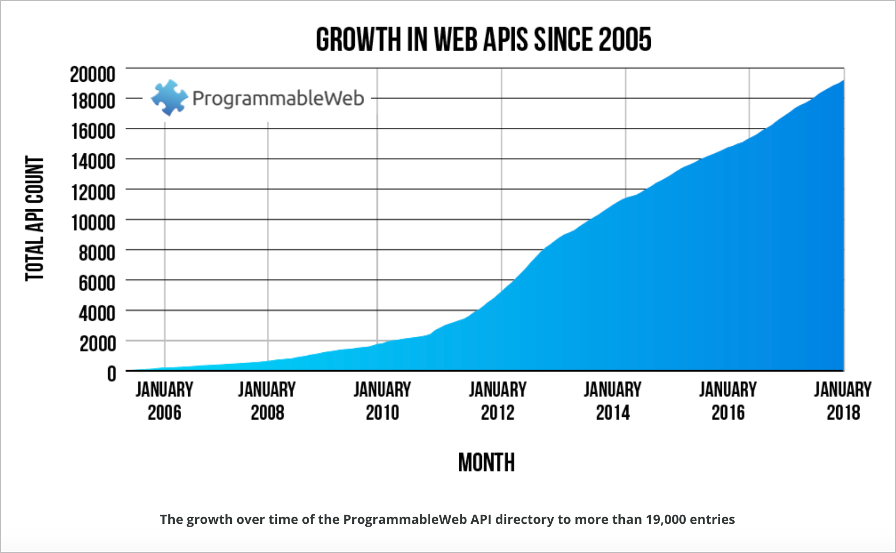
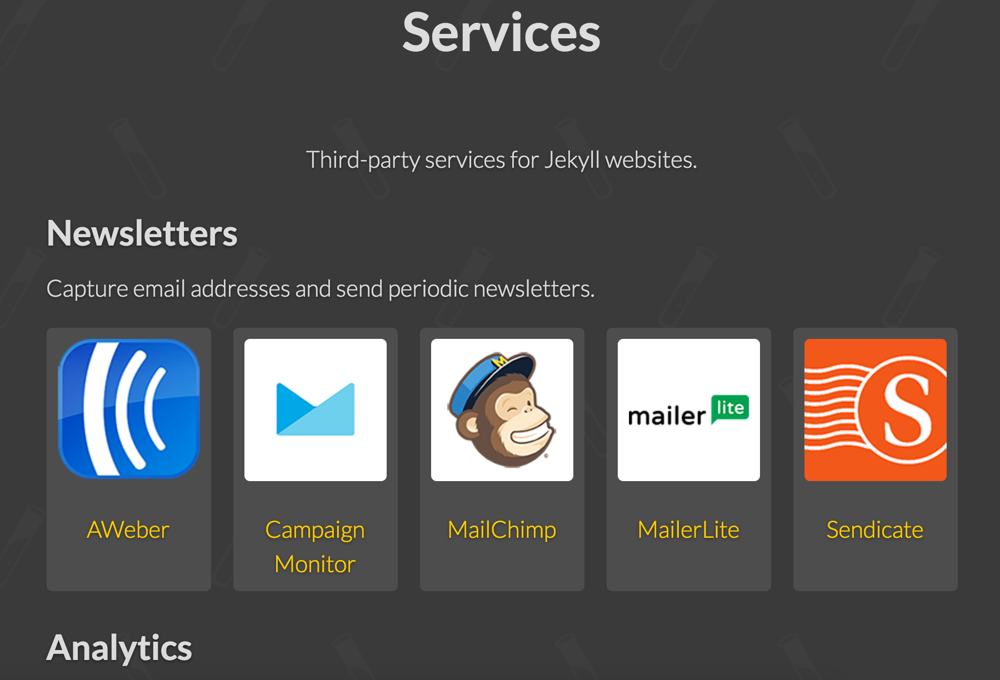
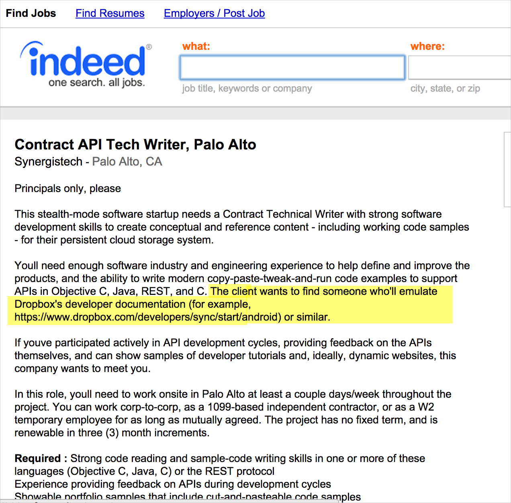
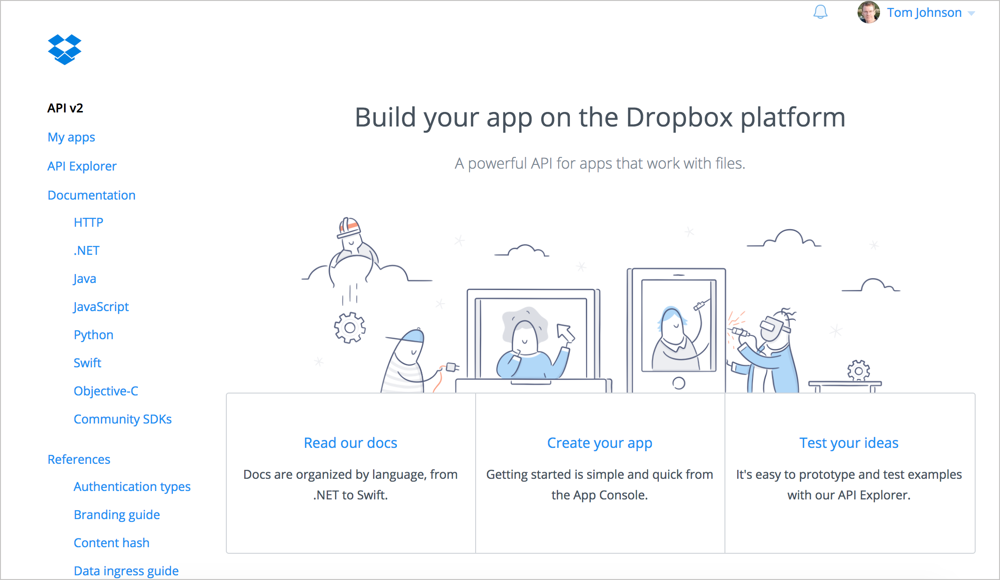
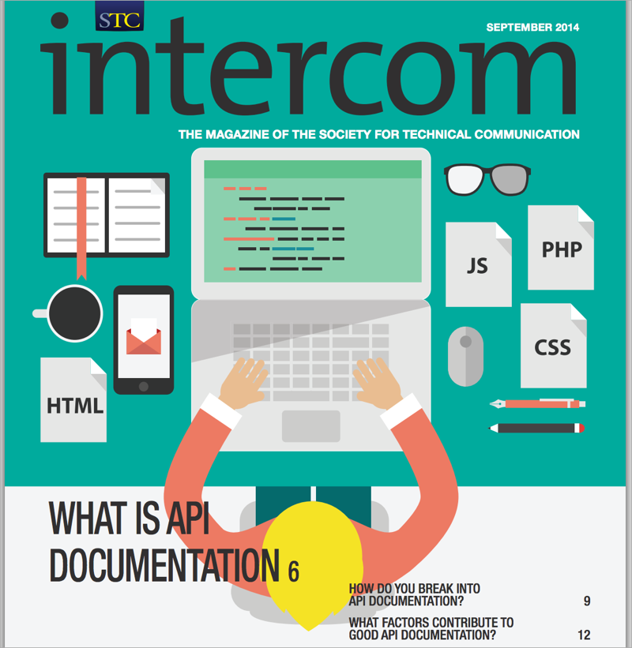

# Рынок API документирования

Прежде чем погрузиться в технические аспекты документирования API узнаем о рынке, основном "пейзаже" и трендах на рынке API документирования.

[Разнообразие API](#diversity)

[Согласно опросам документация это фактор №1 для API](#firstFactor)

[Поскольку REST API являются больше стилем, а не стандартом, то документы необходимы](#essentialDocs)

[Сеть превращается в переплетение API](#mashupAPI)

[Востребованный рынок вакансий тех писателей API](#hotMarket)

[Мир API документации - новинка для большинства тех писателей](#APIworld)

## Разнообразие API

Мир API разнообразен. Помимо API веб-сервисов (которые включают REST), есть API-интерфейсы веб-сокетов, API-интерфейсы аппаратного обеспечения и многое другое. Несмотря на широкое разнообразие, существует в основном только два основных типа API, с которыми взаимодействуют большинство технических писателей:

- [Нативные библиотеки API (например API для Java, C++ и .NET)](../Native-library/Overview-of-library.md);
- [REST API](what-is-rest-api.md).

С REST API нет необходимости предоставлять пользователям библиотеку файлов. Вместо этого пользователи отправляют запросы на ресурсы на веб-сервере, а сервер возвращает ответы, содержащие информацию.

API REST работают по тому же протоколу, что и веб. Когда открываем браузер и вводим URL-адрес веб-сайта (например, [https://idratherbewriting.com](https://idratherbewriting.com)),  фактически делаем запрос GET для ресурса на сервере. Сервер отвечает контентом, а браузер делает контент видимым.

Этот курс сфокусирован в основном на REST API, потому что REST API более популярны и востребованы, а также потому, что они также более доступны для технических писателей. Не нужно знать программирование для документирования REST API. REST становится наиболее распространенным типом API. (Несмотря на это, есть краткое описание API-интерфейсы нативных библиотек в разделе [Обзор нативных библиотек](../Native-library/Overview-of-library.md).)

## Согласно опросам, документация — это фактор №1 для API

Прежде чем приступим к документированию REST API, позвольте рассказать о популярности рынка документации REST API в целом.

В [опросе 2013 года Programmableweb.com](https://www.programmableweb.com/news/api-consumers-want-reliability-documentation-and-community/2013/01/07) (это сайт, который отслеживает и перечисляет веб-API) около 250 разработчиков попросили ранжировать наиболее важные факторы в API. «Полная и точная документация» заняла первое место.

*Опрос показал, что полная и точная документация играет огромную роль для разработчиков*

John Musser, один из основателей [Programmableweb.com](https://www.programmableweb.com/), подчеркивает важность документации в своих презентациях. В [10 причинах, по которым разработчики ненавидят ваш API](https://www.infoq.com/presentations/API-design-mistakes), он говорит, что причина, по которой разработчики ненавидят ваш API, состоит в том, что «ваша документация - отстой».

*API частенько страдают из-за плохой документации*

Если бы API-интерфейсы были редким программным продуктом, все было бы понятно. Но на самом деле API-интерфейсы REST стремительно развиваются. [Programmableweb.com](https://www.programmableweb.com/) составляет чарты и отслеживает количество веб-API, добавленных в их каталог. Programmableweb говорит: «С января 2014 года в среднем добавляется более 2000 API в год» ([исследования показывают, что интерес к предоставлению API все еще высок](https://www.programmableweb.com/news/research-shows-interest-providing-apis-still-high/research/2018/02/23)).

*Феноменальный рост API*

API eBay в 2005 году был одним из первых веб-API (API позволял продавцам управлять своими продуктами в своих магазинах eBay). С тех пор наблюдается огромный рост в веб-API. Учитывая важность четкой и точной документации по API, для технических писателей представляется прекрасная возможность на рынке. Технические писатели могут применять свои навыки общения, чтобы заполнить пробел на быстро растущем рынке.

## Поскольку REST API являются больше стилем, а не стандартом, то документы необходимы

API REST немного отличаются от API SOAP, которые были популярны несколько лет назад. API-интерфейсы SOAP (протокол сервис-ориентированной архитектуры) обеспечивают определенный формат сообщений для отправки запросов и возврата ответов. Как формат сообщений XML, SOAP очень специфичен и имеет файл WSDL (язык описания веб-служб), в котором описывается, как взаимодействовать с API.

Однако API-интерфейсы REST не соответствуют стандартному формату сообщений. REST - это архитектурный стиль, набор рекомендуемых практик для отправки запросов и возврата ответов. Чтобы понять формат запроса и ответа для API REST, мы не обращаемся к спецификации сообщения SOAP или не смотрим файл WSDL. Вместо этого мы обращаемся к документации REST API.

Каждый REST API работает по-своему. Не существует единого способа ведения дел, и эта гибкость и разнообразие подпитывают необходимость в точной и понятной документации. (Больше о REST API в разделе [Что такое REST API?](what-is-rest-api.md)) Поскольку API REST отличаются друг от друга, будут нужны технические писатели, которые будут писать документацию.

## Сеть превращается в переплетение API

Другая причина популярности API заключается в том, что сама сеть превращается в конгломерат API. Вместо огромных, универсальных систем, веб-сайты взаимодействуют с сервисами посредством API.

Например, вместо того, чтобы создавать собственный поиск для поддержки своего веб-сайта, можно использовать сервис  Algolia воспользовавшись [API поиска Algolia](https://www.algolia.com/doc/rest-api/search/). Вместо того, чтобы создавать свой собственный платежный шлюз, можно интегрировать [Stripe API](https://stripe.com/docs/api). Вместо того, чтобы создавать свою собственную систему авторизации, можно использовать [API UserApp](https://app.userapp.io/#/docs/). Вместо того, чтобы создавать собственную систему электронной коммерции, можно использовать [API Snipcart](https://docs.snipcart.com/api-reference/introduction). И так далее.

Практически каждый сервис предоставляет свою информацию и инструменты через API, который вы используете. Jekyll, популярный генератор статических сайтов, не имеет всех компонентов, необходимых для запуска сайта. Здесь нет интеграции новостных рассылок, аналитики, поиска, комментирования, форм, чата, электронной коммерции, опросов или других систем. Вместо этого вы используете нужные вам сервисы на своем статическом сайте Jekyll. CloudCannon собрал длинный [список сервисов](https://cloudcannon.com/tips/2014/12/12/the-ultimate-list-of-services-for-static-websites.html), которые можно интегрировать в свой статический сайт.

*Многие сайты используют необходимые сервисы через внешние API*

Эта модель в стиле кафетерия заменяет массивную модель швейцарской армии, которая пытается сделать все и вся. Лучше полагаться на специализированные компании в создании мощных и надежных инструментов (таких как поиск) и использовать их сервис, а не пытаться создавать все эти сервисы самостоятельно.

Каждый сайт использует свой сервис, как правило, через REST API. В целом, сеть становится переплетением различных сервисов и API, взаимодействующих друг с другом.

## Востребованный рынок вакансий техписателей API

Многие работодатели стремятся нанимать технических писателей, которые могут создавать не только полную и точную документацию, но и стильные материалы для своей документации. Вот вакансия от хантера, ищущего соискателя, который может подражать документации Dropbox:

*Описание вакансии, где ищут человека, умеющего создавать статический сайт в стиле Dropbox*

Как видите, клиент хочет найти «кого-то, кто будет эмулировать документацию Dropbox».

Почему внешний вид документации так важен? Документация API не имеет пользовательского интерфейса для просмотра. Вместо этого документация сама является интерфейсом. Работодатели знают это, поэтому они хотят убедиться, что у них есть необходимые ресурсы, чтобы их документы API выделялись как можно лучше.

Вот как выглядит API Dropbox:

*Сайт API разработчика имеет простой и ясный интерфейс*

Здесь нет сложного дизайна. Но простота и краткость делают его привлекательным. Если учесть, что документация по API в большей или меньшей степени является интерфейсом продукта, создание четкого, современно оформленного сайта документации имеет первостепенное значение для доверия и популярности на рынке. ([В рынок труда погрузимся позже](../Getting-job/job-market.md))

## Мир API документации - новинка для большинства тех писателей

Документация API часто является в диковинку для технических писателей. Многие из компонентов могут отличаться от традиционной документации GUI. Например, все эти аспекты документации разработчика отличаются от традиционной документации:

- инструменты;
- аудитория;
- языки программирования;
- адресные разделы;
- пользовательские задачи.

При попытке сориентироваться в мире документации API, вы поначалу можете быть удивлены этими отличиями и напуганы инструментами и кодом. Кроме того, само содержание документации часто является сложным и требует знакомства с концепциями и процессами разработки.

Понимая, что нужна дополнительная информация, в 2014 году автор принимал участие в редактировании специального выпуска Intercom, посвященного документации API.

*Статья Intercom, сфокусированная на проблеме API документации*

Проблема, озвученная в статье была хорошим началом, но многие технические писатели просили больше обучения. Глава STC Силиконовой долины провел несколько семинаров, посвященных API. Семинары были быстро распроданы (60 участников в первом и 100 участников во втором). Документация по API особенно актуальна в районе залива Сан-Франциско, где многие компании имеют REST API, требующее документации. С тех первых дней автор понял, что документация по API будет горячей темой, поэтому и сосредоточился на этой области в течение следующих нескольких лет - проводя больше презентаций, семинаров и все это время создавая этот всеобъемлющий курс.

По большому счету, технические писатели жаждут узнать больше об API. Этот курс поможет заложить основы того, что нужно знать, чтобы получить работу с документированием API и преуспеть в этой области. Как опытный технический писатель API, вы будете пользоваться высоким спросом и будете играть важную роль в компаниях, которые распространяют свои услуги через API.

[🔙](about-the-author.md)

[Go next ➡](what-is-rest-api.md)
